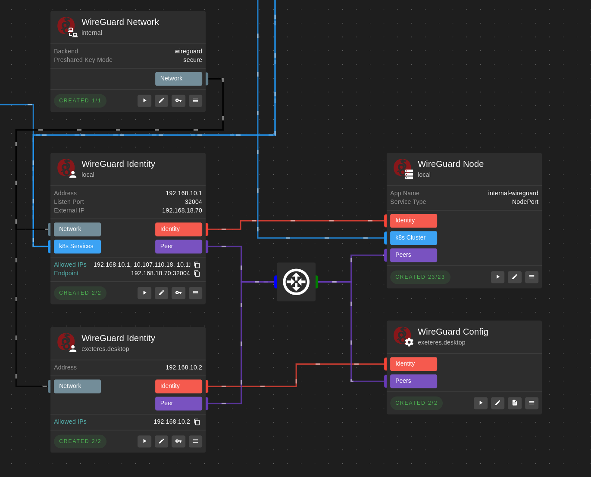

# Highstate Alpha Test Instructions

И наконец-то эту йобу можно запустить.

## Подготовка рабочего окружения

Во всех вариантах потребуется Docker.

### Вариант 1. Dev Container

Понадобится VSCode и расширение Dev Containers.

Далее клонируем репозиторий, открываем его в VSCode и нажимаем "Reopen in Container" в сплывающем окне.

Зависимости будут установлены автоматически.

### Вариант 2. DevEnv

Для NixOS или если установлен Nix, можно использовать [devenv](https://devenv.sh/).

```sh
# Запускаем шелл
devenv shell

# Устанавливаем зависимости
corepack enable
yarn
```

### Вариант 3. Локально

Или можно локально установить Node.js и Yarn, а также `pulumi`, `kubectl`, `helm`. 

Затем установить зависимости аналогично варианту 2.

## Настройка Pulumi

```sh
# Настраиваем локальное хранилище для состояния Pulumi
# Пока что это единственное поддерживаемое хранилище
pulumi login --local
```

## Запуск

Затем внутри контейнера или локально запускаем:

```sh
yarn highstate designer
```

И открываем его в браузере по указанному адресу.

Для остановки используем `Ctrl+C`.

В дизайнере создаем проект, задаем пароль и стараемся его не забыть.

В репозитории помимо `package.json`, где перечислены зависимости Highstate, также есть папка `projects` и файлы `Pulumi.yaml` и `Pulumi.*.yaml`. В последних находятся секреты проектов, зашифрованные паролем. Всё это можно спокойно коммитить в репозиторий.

## Обновление Highstate

```sh
yarn up '@highstate/*'
```

## Рецепты

А теперь к интересному.

### Немного про компоненты

Они же инстансы, они же кубики. Каждый кубик - это отдельная Pulumi программа, создающая необходимые ресурсы в самых разных системах, начиная от облачных провайдеров и заканчивая кубовыми кластерами. Кубики могут экспортировать различные сущности, которые могут быть использованы другими кубиками. Помимо этого, у них есть статические параметры и секреты, которые можно задать в дизайнере. У каждого кубика есть имя, которое должно быть уникальным в рамках всех кубиков его типа. Для кубиков разного типа можно использовать одинаковые имена - это особенно удобно если они являются логической частью одного целого.

### Импорт существующего сервера

Пожалуй, самый правильный способ импортировать существующий сервер:
- создать кубик `SSH Key Pair`, запустить его, чтобы сгенерировать ключи;
- скопировать публичный ключ и добавить его в `~/.ssh/authorized_keys` на сервере;
- создать кубик `Existing Server`, указать IP-адрес сервера и подключить `SSH Key Pair`.


Один `SSH Key Pair` можно использовать для нескольких серверов.

Альтернативно, можно в кубике `SSH Key Pair` (или напрямую в `Existing Server`) указать в секретах существующий приватный ключ. Также можно просто указать пароль.

Уже ради одного этого кубика стоит использовать Highstate. Ведь прямо внури дизайнера можно запустить терминал, который подключится к серверу по SSH.

### Импорт существующего кластера Kubernetes

Создать кубик `Existing Kubernetes Cluster`, указать адрес API-сервера и в секретах полный kubeconfig, содержащий один кластер. Если кластеров несколько, то возможно случится что-то нехорошее (скорее всего возьмется первый).

Также пока что нельзя засунуть kubeconfig в формате YAML, так что придется преобразовать его в JSON или экспортировать командой `kubectl config view -o json`.


### Создание кластера Kubernetes

Самый простой способ создать кластер Kubernetes - это кубик `K3s Cluster`, который может создать кластер на одном сервере с какой-нибудь православной операционкой (вроде Ubuntu).


Никаких проблем на этом этапе возникнуть не должно.

У кубовых кластеров, также как и у серверов, есть возможность запускать терминал. Но в случае кластера это будет локальный терминал, в котором будет доступен настроенный `kubectl` для конкретного кластера.

### Proxmox и виртуалки

Для создания различных ресурсов в Proxmox есть обязательный кубик `Proxmox Connection`, в котором надо указать данные для подключения. `Default Node Name` и `Default Datastore ID` можно не задавать, кубик самостоятельно найдет подходящие значения в случае кластера из одного узла.

Для работы с ISO-образами есть два кубика `Proxmox Existing Image` и `Proxmox Image`. В первом достаточно просто указать ID образа, во втором же надо загрузить образ из URL. 

> Sha256 указывать обязательно. Eсли у вас его нет, то просто впишите в это поле стихотворение Маяковского или рецепт борща. При попытке загрузки образа он выдаст ошибку несоответствия хеша, указав какой хеш ожидался.

Кубик `Proxmox Virtual Machine` может создать виртуалку с необходимыми параметрами. Этот кубик, как и все другие, можно безопасно запускать несколько раз, но он довольно дикий. Будьте готовы, что он снесет вам виртуалку если вы измените какой-то параметр, который он посчитает несовместимым с жизнью уже существующей.


### Talos

На основе виртуалок с подключенным образом Talos можно создать кубовый кластер с помощью кубика `Talos Cluster`, подключив к нему виртуалки в инпуты `Masters` и `Workers` в зависимости от их роли. Если в кластере указать только мастер-ноды, то им будет разрешено планировать на себе рабочие нагрузки.


В настройках кубика можно выбрать CNI и CSI, а также указать дополнительные патчи конфигурации.

По умолчанию, в качестве CNI используется `cilium`, а в качестве CSI - `local-path-provisioner`.

### Access Points

Чтобы созданные приложения и сервисы были доступны извне, им нужна такая штука как точка доступа.

Access Point - это абстракция, состояющая из трех вещей:

- Gateway: реверс-прокси, который принимает входящие запросы и перенаправляет их на сервисы;
- TLS Issuer: Issuer из cert-manager, который умеет выдавать сертификаты;
- DNS Provider: провайдер DNS, который умеет создавать записи в DNS.

Этих трех компонентов достаточно в большинстве случаев, чтобы сделать сервис доступным извне.
И реализованы они могут быть разными способами, а точки доступа позволяют их комбинировать.

Пока что из DNS-провайдеров поддерживается только `Cloudflare`, а из TLS Issuer - только `DNS01 Issuer`, которому нужен DNS-провайдер для выпуска сертификатов.


> Обратите внимание на то, что `DNS01 Issuer` требует наличия в кластере `cert-manager`, поэтому его инпут с k8s кластером подключается от выхода `cert-manager`. Это позволят кубику дождаться установки `cert-manager` перед созданием `DNS01 Issuer`.

В качестве Gateway предлагается использовать `Traefik`. В данном случае он создается в `ServiceType = ClusterIP`, что предполагает его использование внутри VPN. Если же нужно организовать доступ через интернет, то можно поменять тип сервиса на `LoadBalancer` или `NodePort`.

### Бекапы

Для бекапов существует целый механизм, который с помощью джобов и крон-джобов восстанавливает и выполняет регулярные бекапы через [restic](https://restic.net/). Он же в свою очередь использует [rclone](https://rclone.org/) для работы с облачным хранилищем.

Каждое приложение, поддерживающее бекапы (вроде базы данных), автоматически создаст необходимые джобы и репозиторий в облачном хранилище. От пользователя только требуется настроить хранилище и указать его в кубике `Restic Repo`. Для этого надо локально с помощью rclone залогиниться в него и в кубике `Restic Repo` указать конфигурацию из `~/.config/rclone/rclone.conf`.

Приложение с настроенными бекапами можно уничтожать и создавать заного в любой момент, сохраняя его данные. При этом при уничтожении приложения автоматически выполняется бекап всех его данных. Таким образом можно переносить его между кластерами.

### Базы данных

Ооо базовое данновое. Базы данных уже считаются полноценными приложениями. На вход им нужен как минимум кубовый кластер, а также они могут принимать на вход `Restic Repo` и `DNS Provider`. Первый позволит им выполнять автоматические бекапы, а последний - создавать записи в DNS по указанному домену. Стоит отметить, что эти записи не обязательны для работы зависимых от БД приложений внутри кластера.


На этой картинке также видна такая штука как хабы. Хабы позволяют объединить любое количество инпутов в один "пучок", который затем можно запихнуть в любой кубик. Кубик выберет из этого хаба только те инпуты, которые ему нужны. Это позволяет не указывать большое количество зависимостей вручную, а также быстро заменять зависимости целого набора кубиков на другие.

### Приложения

И наконец то, ради чего создавалась вся эта инфраструктура - конечные приложения, вроде `Kubernetes Dashboard` или `Vaultwarden`. На вход такие приложения требуют кубовый кластер и точку доступа, а также для них необходимо указать `FQDN`, по которому они будут доступны. Также многие приложения требуют на вход одну из баз данных, а если они хранят данные самостоятельно, то могут также принимать `Restic Repo` для бекапов.


### WireGuard

Finally, WireGuard. Это целый набор кубиков, который позволяет организовать VPN-сеть между серверами и их клиентами.

Выглядит примерно следующим образом:



Кубик `WireGuard Network` опционален, но в нем можно указать тип бекенда (`wireguard` или `amneziawg`), а также режим генерации pre-shared ключей. Если вся сеть управляется Highstate, то лучше использовать использовать режим `secure`, который для каждой отдельной пары узлов сгенерирует уникальный ключ.

Сами же узлы разделены на две части - `WireGuard Identity` и `WireGuard Node` или `WireGuard Config`. Первый кубик определяет адрес узла в сети, содержит его ключи (которые, естественно, могут быть сгенерированы автоматически), а также определяет `endpoint`, по которому к узлу можно подключиться. Кубик `WireGuard Node` создает в кубовом кластере Deployment для указанного узла и его пиров. Аналогично, `WireGuard Config` создает конфигурацию для клиента, которую можно использовать для подключения к сети извне.

`WireGuard Identity` также может принимать на вход `k8s Services`, который экспортируют некоторые кубики вроде `Traefik Gateway` или базы данных. На их основе генерируется `Allowed IPs` для узла, а также создаются политики безопасности внутри кластера, если этот `Identity` используется в `WireGuard Node`.

### Заключение

Я устал. Пока всё. Это не следует воспринимать как документацию, это просто набор заметок, которые позволят быстрее понять Highstate. 